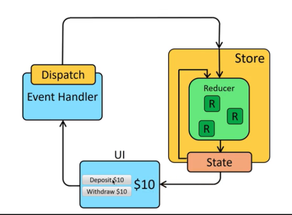

## 為什麼我們需要 Redux？
*****
當專案架構越來越大，管理資料的狀態變得越來越困難，因此需要一個統一的方式來集中管理。  
Redux 建立了一個統一的資料來源 -> store，不用再透過父元件傳遞資料下去，可以直接透過 store 取得資料，更有條理的去管理所有資料狀態。

## Redux 是什麼？可以簡介一下 Redux 的各個元件跟資料流嗎？
*****
1. Action  
    Actions 是從應用程式傳遞資料到 store 的資訊 payload。它們是 store 唯一的資訊來源。藉由 store.dispatch() 來把它們傳遞到 store。
2. Reducer  
    Action 傳遞資料到 store 後，由 reducer 根據 Action 去處理應用程式的 state 要如何去應對改變。
3. Store  
    Store 結合所有物件，包含 state 和 Action，全部都放在 Store 裡儲存。

  
根據上圖，Redux 資料流遵循幾個步驟：  
1. 呼叫 store.dispatch(action)  
   action 是一個描述發生什麼事的一般物件，例如下面舉例，type 顯示要呼叫哪個 action type，並攜帶如 articleId, response 等等的資訊。
   ```javascript
    { type: 'LIKE_ARTICLE', articleId: 42 }
    { type: 'FETCH_USER_SUCCESS', response: { id: 3, name: 'Mary' } }
    { type: 'ADD_TODO', text: 'Read the Redux docs.' }
   ```
2. Redux store 呼叫 action 給的 reducer function  
    store 收到 action 後，會傳遞目前的 state 和 action 給 reducer，接著 reducer 會去執行 action 並產生新的 state。
3. root reducer 可以把多個 reducer 的 output 合併成一個單一的 state tree  
    假設有多個 reducer，則 root reducer 會把多個 reducer的 output 合成一個 state tree 並回傳。
4. Redux store 儲存 root reducer 回傳的完整 state tree  
    最後 store 儲存 root reducer 回傳的 state 並重新 render UI 畫面。


## 該怎麼把 React 跟 Redux 串起來？
*****
React-redux api 提供 Provider，讓 redux 可以把 store 傳給所有的 container，如下面程式碼：  
```jSX
  ReactDOM.render(
  <React.StrictMode>
    <Provider store={store}>
      <App />
    </Provider>
  </React.StrictMode>,
  document.getElementById('root')
)
```
接著使用 `useSelector` 便可以取得 redux store 中 state 的資料，使用 `useDispatch` 也可以取得 redux 的 action：
```jSX
function App() {
  const todos = useSelector(selectTodos)
  const filter = useSelector(selectFilter)
  const dispatch = useDispatch()
  return (
    <button onClick={() => dispatch(filterTodo('all'))}>All</button>
  )
```
也可以把 redux 的 state, action 當作 props 傳給各個 components：
```jSX
    return (
      <Header />
      <TodoItem
        todos={todos}
        deleteTodo={actions.deleteTodo}
      />
      <Addtodos
        addrecipe={actions.addRecipe}
      />
    )
    
```


